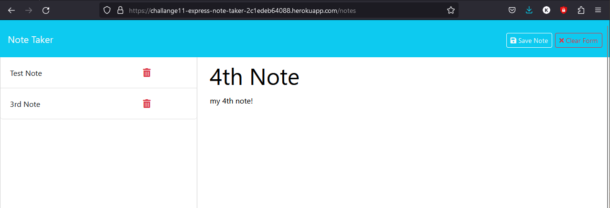

# Express.JS Note Taker

The Express.JS Note Taker application was created to allow a user to go to a deployed website where they can retrieve, submit, and delete their notes.
The application is deployed using express.js npm library, and hosted on the Heroku servers. This express application contains a JSON database where all of the user's data is stored.

## Features

- Note Taker app is deployed on Heroku, using express.js npm library.
- db.json is named the database holding all the user data, where read/write operations are taking place.
- uuidv4 npm library is used to generate and attach a unique-id to every new user note.
- the user can view their previous notes on page refresh, and they can create a new note, and or delete previous notes.
- the host root route takes a user to the landing page, with a button to start taking notes.
- the /notes endpoint displays the Note Taker/ Tracker page.
- the /api/notes endpoint is used by the client script to communicate with the server, specifically the GET and POST fetch methods.
- the /api/notes/:id parameter endpoint is used to communicate with the server for previous note deletion.

## Appendix

https://www.npmjs.com/package/express/v/4.16.4

https://expressjs.com/

https://developer.mozilla.org/en-US/docs/Learn/Server-side/Express_Nodejs/Introduction

https://www.npmjs.com/package/uuid/v/8.3.2

https://coding-boot-camp.github.io/full-stack/heroku/how-to-install-the-heroku-cli

## Authors

- [Syed Kazmi](https://github.com/kazmiali123)

## Deployment

Heroku Deployed URL: https://challange11-express-note-taker-2c1edeb64088.herokuapp.com/

GitHub Repository: https://github.com/kazmiali123/Challange11-Express-Note-Taker.git

## Demo

